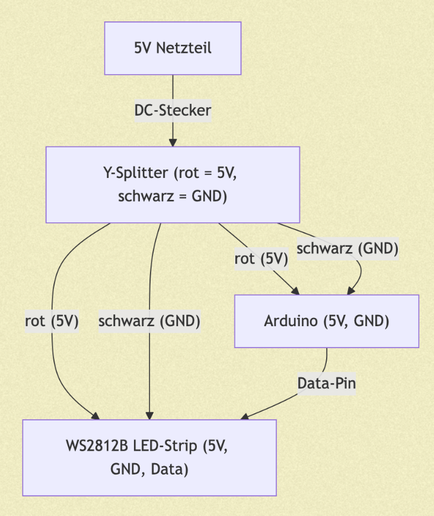

## Project quick facts
- Name: **Echo Lamp**
- Author: **Ella Pulkert**
- Inspired by: Rupak Poddar (https://www.youtube.com/watch?v=w9_OhG3QlUg)

## Technological Hardware and Setup

### Shopping List
I presented my idea and what materials I wanted to use in my presentation and got good feedback on that, so I ordered the following things:
- Power Supply + Y-Split Adapter + DC Screw Terminal Adapters to contribute power from one source to both the LED strip and the arduino (see power setup underneath)
- LED Strip
- Audio detector with Automatic Gain controll -> in retrospective, the AGC caused a lot of problems, because once music was running, it leveled down the noise and therefore stopped the reaction

**Power Setup**

### Setup 
Setting up the technological hardware was pretty simple, because there weren't many components to it. I also was lucky to be able to use my initial setup without having to change a lot during the coding process. I only added more resistors to to the LED strip connection, to prevent voltage spikes caused by irregular power supply. One thing that caused me some troubles, was powering the arduino by the external power source. Because my laptop powered it all throughout the coding process, I only realized after changing the connection, that the new ground/reference conditions and supply stability, affected the signal levels and noise and therefore shifted the thresholds and smoothing behavior.

## Coding Process

### 1. Step: Starting from an inspiration sketch
I started with a FastLED sound-reactive example (by Rupakpoddar: https://github.com/Rupakpoddar/Sound-reactive-LED-strip) (same idea: `analogRead()` → `map()` → LED effect). This worked as a quick proof of concept, but in real use it caused problems: the LEDs reacted to noise, flickered, and behaved very differently depending on how loud the music was.

### 2. Step: Solving “silence is not zero” (noise floor)
**Problem:** Even in silence, the microphone/amp outputs a baseline value and noise.  
**Solution:** I added a **startup calibration** (averaging many samples) to estimate a **noise floor** and subtract it from every reading. This prevents random flashing when the room is quiet.

> **AI use:** ChatGPT helped me with the idea/structure and code of tracking and updating the noise floor only in quiet mode to reduce Automatic-Gain-Control-related drift and random triggers.

### 3. Step: Making the signal smooth (envelope follower)
**Problem:** Raw audio changes too fast and produces flicker.  
**Solution:** I implemented an **envelope follower** with **fast attack / slow release**. This keeps the lamp responsive to beats but makes the fade-out smooth and organic.

### 4. Step: Switching between idle and reactive (gate with hysteresis)
**Problem:** Background noise can constantly trigger the effect, and the lamp can rapidly toggle near a small noise source.  
**Solution:** I added a **gate** with two thresholds (**ON** and **OFF**) so the lamp only enters reactive mode when the sound is clearly loud enough and only returns to idle when it becomes clearly quiet again. In idle mode the LEDs blend back to a warm dim color so the lamp never goes fully black. I calibrated the right GATE level quite a long time.

> **AI use:** I used ChatGPT help to structure the gate logic to avoid unstable switching.

### 5. Step: Making peaks visible (peak-hold)
**Problem:** Short loud hits can disappear too quickly to be visually readable.  
**Solution:** I added a **peak-hold** value that decays over time. This makes strong beats “flare” briefly and then fade smoothly instead of flashing for a single frame.

### 6. Step: Making it work at different volumes (auto-range)
**Problem:** Fixed min/max thresholds only work for one environment (quiet phone vs loud speake.  
**Solution:** I track a dynamic reference level (“peak”) and normalize the envelope to it. This keeps the effect usable across different volume levels without constantly retuning constants.

> **AI use:** ChatGPT helped coding the interaction between peak-hold and auto-ranging so it stays stable and doesn’t overreact to noise.

### 7. Step: Final visual design (ember look + stability)
The final effect maps the audio energy mainly to **how many LEDs are active** (length of the glow). That active length is additionally smoothed so it doesn’t jitter frame-to-frame. Visually, the active area is rendered as a warm **core** (orange → yellow with loudness) plus a red **shell** for depth, while inactive LEDs blend back to the warm idle tone.

## Building the Lampshade

I quickly realized, that most of the inspiration I collected for the lampshade would be pretty hard and expensive to make by myself. On the other hand, I had a very specific look in my head: it had to be a semi transparent, organic, warm and soft look:

I decided to look for options to buy and found a good solution: https://www.ikea.com/de/de/p/krusning-haengeleuchtenschirm-weiss-00259914/

The best thing about this lampshade was, that it allowed me to shape it just the way I needed it. I customized it a little by cutting out some layers of paper and glueing it to the right shape.

